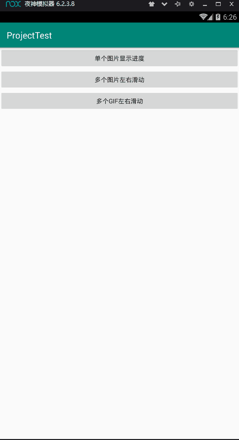

# ProjectTest
该项目存放所有的 Demo，其中是各个效果的实现展示

在自定义的 CircleView 中实现了动画而不是在外部调用实现

在实现动画的时候有一个小坑，就是我们习惯了直接 this.value = value，所以不管三七二十一上来就写，不过这里动画的值就没了变化
所以此行应该删除，大家可以看代码了解

平时各个需要的效果例子写出来

只加载一张图片的效果

加载多张图片

加载多张动图

